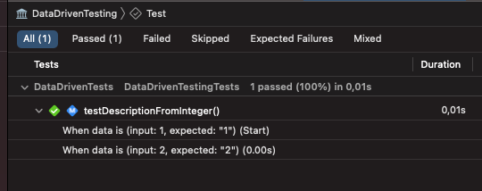
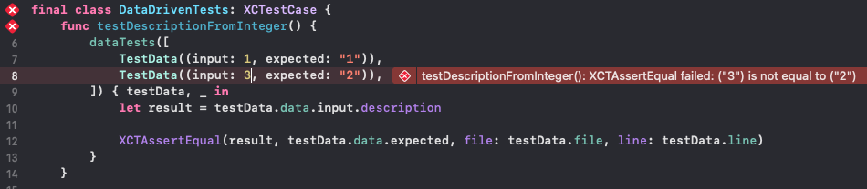
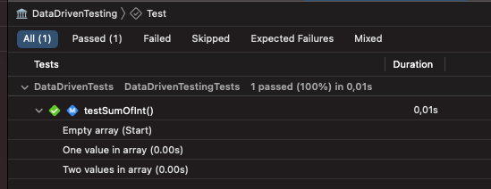

# DataDrivenTesting

A Swift package that provides data-driven testing functionality for your project.

[](https://swiftpackageindex.com/WezSieTato/DataDrivenTesting)
[](https://swiftpackageindex.com/WezSieTato/DataDrivenTesting)
[](https://github.com/WezSieTato/DataDrivenTesting/actions/workflows/tests.yml)
[](https://github.com/WezSieTato/DataDrivenTesting/actions/workflows/lint.yml)

## Usage

To run a test with data-driven testing, you just need to run `dataTests` method on your test case:

```swift
@testable import DataDrivenTesting
import XCTest

final class DataDrivenTests: XCTestCase {
    func testDescriptionFromInteger() {
        dataTests([
            TestData((input: 1, expected: "1")),
            TestData((input: 2, expected: "2")),
        ]) { testData, _ in
            let result = testData.data.input.description

            XCTAssertEqual(result, testData.data.expected, file: testData.file, line: testData.line)
        }
    }
}
```

This will run the test for each data from array using passed closure. To get more readable test results, you can check Report Navigator in Xcode. It will show you all test cases with data that was used to run them.



Passing file and line parameters to `XCTAssertEqual` is optional, but it will help you to find the failing test case in the code.



You can also change default activity name by passing name as a second parameter to `TestData` struct:

```swift
    func testSumOfInt() {
        dataTests([
            .init(([], 0), name: "Empty array"),
            .init(([1], 1), name: "One value in array"),
            .init(([2,3], 5), name: "Two values in array"),

        ]) { testData, activity in
            let result = testData.data.0.reduce(0, +)

            XCTAssertEqual(result, testData.data.1, file: testData.file, line: testData.line)
        }
    }
```

Which will result in Report Navigator like this:



If you need add any attachments to your test case, you can use `XCTActivity` parameter in closure:

```swift
    private struct CEO: Encodable {
        let firstName: String
        let lastName: String
    }

    func testUsingActivity() {
        dataTests([
            TestData(CEO(firstName: "Steve", lastName: "Jobs")),
            TestData(CEO(firstName: "Tim", lastName: "Cook")),
        ]) { testData, activity in
            let json = try! JSONEncoder().encode(testData.data)

            let attachment = XCTAttachment(data: json)
            attachment.lifetime = .keepAlways
            activity.add(attachment)
        }
    }
```
## Requirements

* Swift 5.4+
* Xcode 9.0+

## Installation

### Xcode

> ⚠️ Warning: By default, Xcode will try to add the DataDrivenTesting package to your project's main application/framework target. Please ensure that DataDrivenTesting is added to a _test_ target instead, as documented in the last step, below.

 1. From the **File** menu, navigate through **Swift Packages** and select **Add Package Dependency…**.
 2. Enter package repository URL: `https://github.com/WezSieTato/DataDrivenTesting`
 3. Confirm the version and let Xcode resolve the package
 4. On the final dialog, update DataDrivenTesting's **Add to Target** column to a test target that will contain data tests (if you have more than one test target, you can later add DataDrivenTesting to them by manually linking the library in its build phase)

### Swift Package Manager

If you want to use DataDrivenTesting in any other project that uses [SwiftPM](https://swift.org/package-manager/), add the package as a dependency in `Package.swift`:

```swift
dependencies: [
  .package(
    url: "https://github.com/WezSieTato/DataDrivenTesting",
    from: "1.0.0"
  ),
]
```

Next, add `DataDrivenTesting` as a dependency of your test target:

```swift
targets: [
  .target(name: "MyApp"),
  .testTarget(
    name: "MyAppTests",
    dependencies: [
      "MyApp",
      .product(name: "DataDrivenTesting", package: "DataDrivenTesting"),
    ]
  )
]
```

## License

This library is released under the MIT license. See [LICENSE](LICENSE) for details.
